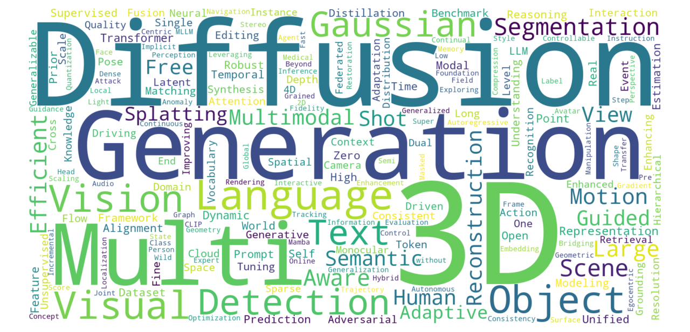

# ICCV 2025 Transfer Learning

1. Diffusion-based Source-biased Model for Single Domain Generalized Object Detection
2. Domain-aware Category-level Geometry Learning Segmentation for 3D Point Clouds
3. TITAN: Query-Token based Domain Adaptive Adversarial Learning
4. Graph Domain Adaptation with Dual-branch Encoder and Two-level Alignment for Whole Slide Image-based Survival Prediction
5. What's in a Latent? Leveraging Diffusion Latent Space for Domain Generalization
6. DCT-Shield: A Robust Frequency Domain Defense against Malicious Image Editing
7. Pseudo-SD: Pseudo Controlled Stable Diffusion for Semi-Supervised and Cross-Domain Semantic Segmentation
8. Adversarial Data Augmentation for Single Domain Generalization via Lyapunov Exponent-Guided Optimization
9. Split-and-Combine: Enhancing Style Augmentation for Single Domain Generalization
10. Hybrid-TTA: Continual Test-time Adaptation via Dynamic Domain Shift Detection
11. Borrowing Eyes for the Blind Spot: Overcoming Data Scarcity in Malicious Video Detection via Cross-Domain Retrieval Augmentation
12. Chimera: Improving Generalist Model with Domain-Specific Experts
13. DATA: Domain-And-Time Alignment for High-Quality Feature Fusion in Collaborative Perception
14. Group-wise Scaling and Orthogonal Decomposition for Domain-Invariant Feature Extraction in Face Anti-Spoofing
15. Unified Video Generation via Next-Set Prediction in Continuous Domain
16. ASGS: Single-Domain Generalizable Open-Set Object Detection via Adaptive Subgraph Searching
17. Dual-Rate Dynamic Teacher for Source-Free Domain Adaptive Object Detection
18. Domain Generalizable Portrait Style Transfer
19. PHATNet: A Physics-guided Haze Transfer Network for Domain-adaptive Real-world Image Dehazing
20. Exploiting Domain Properties in Language-Driven Domain Generalization for Semantic Segmentation
21. CoSMIC: Continual Self-supervised Learning for Multi-Domain Medical Imaging via Conditional Mutual Information Maximization
22. DALIP: Distribution Alignment-based Language-Image Pre-Training for Domain-Specific Data
23. Frequency Domain-Based Diffusion Model for Unpaired Image Dehazing
24. CounterPC: Counterfactual Feature Realignment for Unsupervised Domain Adaptation on Point Clouds
25. Bridging Domain Generalization to Multimodal Domain Generalization via Unified Representations
26. AdaDCP: Learning an Adapter with Discrete Cosine Prior for Clear-to-Adverse Domain Generalization
27. Dual Domain Control via Active Learning for Remote Sensing Domain Incremental Object Detection
28. Boosting Domain Generalized and Adaptive Detection with Diffusion Models: Fitness, Generalization, and Transferability
29. UniDxMD: Towards Unified Representation for Cross-Modal Unsupervised Domain Adaptation in 3D Semantic Segmentation
30. Toward Fair and Accurate Cross-Domain Medical Image Segmentation: A VLM-Driven Active Domain Adaptation Paradigm
31. Adapting In-Domain Few-Shot Segmentation to New Domains without Retraining
32. FreeDNA: Endowing Domain Adaptation of Diffusion-Based Dense Prediction with Training-Free Domain Noise Alignment
33. Customizing Domain Adapters for Domain Generalization
34. UPRE: Zero-Shot Domain Adaptation for Object Detection via Unified Prompt and Representation Enhancement
35. UMDATrack: Unified Multi-Domain Adaptive Tracking Under Adverse Weather Conditions
36. Exploring Probabilistic Modeling Beyond Domain Generalization for Semantic Segmentation
37. DAP-MAE: Domain-Adaptive Point Cloud Masked Autoencoder for Effecitve Cross-Domain Learning
38. Semi-supervised Deep Transfer for Regression without Domain Alignment
39. M$^2$EIT:Multi-Domain Mixture of Experts for Robust Neural Inertial Tracking
40. Adapting Vehicle Detectors for Aerial Imagery to Unseen Domains with Weak Supervision
41. ConstStyle:  Robust Domain Generalization with Unified Style Transformation
42. Stronger, Steadier & Superior: Geometric Consistency in Depth VFM Forges Domain Generalized Semantic Segmentation
43. Towards Effective Foundation Model Adaptation for Extreme Cross-Domain Few-Shot Learning
44. MergeOcc: Bridge the Domain Gap between Different LiDARs for Robust Occupancy Prediction
45. Debiased Teacher for Day-to-Night Domain Adaptive Object Detection
46. DADM: Dual Alignment of Domain and Modality for Face Anti-spoofing
47. SciVid: Cross-Domain Evaluation of Video Models in Scientific Applications
48. Att-Adapter: A Robust and Precise  Domain-Specific Multi-Attributes T2I Diffusion Adapter via Conditional Variational Autoencoder
49. Weakly Supervised Dynamic Scene Graph Generation with Temporal-enhanced In-domain Knowledge Transferring
50. Federated domain generalization with domain-specific soft prompts generation
51. From Sharp to Blur: Unsupervised Domain Adaptation for 2D Human Pose Estimation Under Extreme Motion Blur Using Event Cameras
